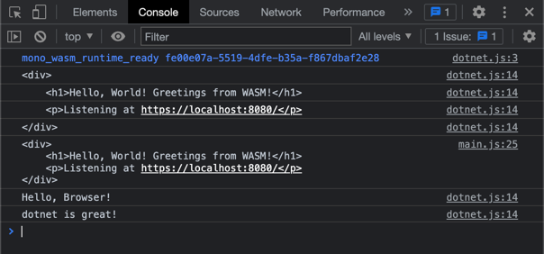

## WASM Running .NET in a Browser

This solution shows you can compile .NET to target a WASM app bundle that can
be used independently of a dotnet application.

## Getting Started

You'll need the latest .NET 7 SDK (RC2+), and the workloads of `wasm-tools` and `wasm-experimental`.

```bash
dotnet workload install wasm-tools
dotnet workload install wasm-experimental
```

This uses the `dotnet new wasmbrowser` template.

## Run

To run this solution, run the following commands.

```bash
dotnet tool restore && dotnet r start
```

Then open your browser to `https://localhost:8080` and be sure to open up the dev tools to see the console output.



## Points of Interest

- [Program.cs](Program.cs) : Where the .NET code is written that runs in the browser
- [Project](HelloDotnetWasm.csproj): Notice there are no special dependencies, this is part of the SDK and uses the `wasm-tools` and `wasm-experimental` workloads. Also notice the `<RuntimeIdentifier>browser-wasm</RuntimeIdentifier>` element.
- AppBundle (bin/$(Configuration)/net7.0/browser-wasm/AppBundle): This is the built application along with the static files.
- [Main](main.js) - Notice how the wasm file is loaded

## C#

There are a few things to note in this file worth paying attention to.

1. This is a top-level statement file, and the `Main` method is implicit. The `Console.WriteLine` method calls are the app.
2. The `MyClass` implementation uses the `JsExport` and `JsImport` attributes. This is our connection to the WASM runtime.

```c#
using System;
using System.Runtime.InteropServices.JavaScript;

// ReSharper disable MemberCanBePrivate.Global

Console.WriteLine("Hello, Browser!");
Console.WriteLine(string.Join(" ", args));

public partial class MyClass
{
    [JSExport]
    internal static string Greeting()
    {
        // language=html
        var text = 
        $"""
        <div>
            <h1>Hello, World! Greetings from WASM!</h1>
            <p>Listening at {GetHRef()}</p>
        </div>
        """;
        Console.WriteLine(text);
        return text;
    }

    [JSImport("window.location.href", "main.js")]
    internal static partial string GetHRef();
}
```

## JavaScript

Important notes about this file.

1. The import of the `dotnet.js` file pulls in the runtime and helper methods, that allow you to get the exports of the .NET module and set the necessary imports.
2. The `config` object is more about the application interface/manifest than what you'd traditionally think of as "configuration"
3. Accessing C# types is by namespace, class, and method tokens. See how it matches the partial type definition in C#.
4. The use of `runMainAndExit` allows you to pass in arguments like you would with any console application. 

```javascript
// Licensed to the .NET Foundation under one or more agreements.
// The .NET Foundation licenses this file to you under the MIT license.

import { dotnet } from './dotnet.js'

const is_browser = typeof window != "undefined";
if (!is_browser) throw new Error(`Expected to be running in a browser`);

const { setModuleImports, getAssemblyExports, getConfig, runMainAndExit } = await dotnet
    .withDiagnosticTracing(false)
    .withApplicationArgumentsFromQuery()
    .create();

setModuleImports("main.js", {
    window: {
        location: {
            href: () => globalThis.window.location.href
        }
    }
});

const config = getConfig();
const exports = await getAssemblyExports(config.mainAssemblyName);
const html = exports.MyClass.Greeting();
console.log(html);


document.getElementById("out").innerHTML = `${html}`;
await runMainAndExit(config.mainAssemblyName, ["dotnet", "is", "great!"]);
```

## Outstanding Questions

- How do you deploy something like this, especially if you have multiple WASM files?
- Do you need all the files in the AppBundle?

# Thanks

Thanks to Pavel Šavara for writing this blog post (https://devblogs.microsoft.com/dotnet/use-net-7-from-any-javascript-app-in-net-7/).